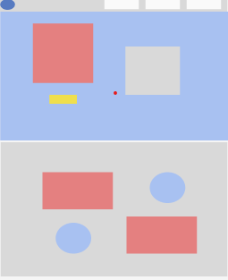
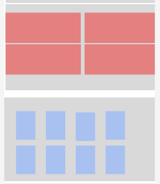

# Tarjeta de crédito válida

## Índice

* [1. Resumen del proyecto](#1-resumen-del-proyecto)
* [2. Objetivos de aprendizaje](#2-objetivos-de-aprendizaje)
* [3. Consideraciones generales](#3-Proceso-Creativo)
* [4. Criterios de aceptación mínimos del proyecto](#4-Pre-requisitos)
* [5. Pistas, tips y lecturas complementarias](#5-Demo)

***


## 1. Resumen del proyecto

En este proyecto se propuso a partir del algoritmo de Lunh, crear una pagina de 
libros online, la cual cuando nos llevara a la parte de sucribirse hicieramos la 
validacion de la tarjeta de credito como metodo de pago. Ademas, de ello se planteo 
implementar funcionalidad para ocultar todos los dígitos de una tarjeta menos
los últimos cuatro.

Para esto se planteo una pagina de libros online, llamada BookPod, que contenia 
diferentes secciones (inicio, quienes somos, libros, planes de suscripcion), y ademas
una  pagina de pago donde se realizaria la validacion del pago.

La pagina se construyo a partir del uso de  HTML, CSS y JavaScript como tecnologías.


## 2. Objetivos de aprendizaje

Reflexiona y luego marca los objetivos que has llegado a entender y aplicar en tu proyecto. Piensa en eso al decidir tu estrategia de trabajo.

### HTML

- [x] **Uso de HTML semántico**

### CSS

- [x] **Uso de selectores de CSS**
- [x] **Modelo de caja (box model): borde, margen, padding**


### Web APIs

- [x] **Uso de selectores del DOM**
- [x] **Manejo de eventos del DOM (listeners, propagación, delegación)**
- [x] **Manipulación dinámica del DOM**


### JavaScript

- [x] **Tipos de datos primitivos**
- [x] **Strings (cadenas de caracteres)**
- [x] **Variables (declaración, asignación, ámbito)**
- [x] **Uso de condicionales (if-else, switch, operador ternario, lógica booleana)**
- [x] **Uso de bucles/ciclos (while, for, for..of)**
- [x] **Funciones (params, args, return)**
- [x] **Pruebas unitarias (unit tests)**
- [x] **Módulos de ECMAScript (ES Modules)**
- [x] **Uso de linter (ESLINT)**
- [x] **Uso de identificadores descriptivos (Nomenclatura y Semántica)**

### Control de Versiones (Git y GitHub)

- [x] **Git: Instalación y configuración**
- [x] **Git: Control de versiones con git (init, clone, add, commit, status, push, pull, remote)**
- [x] **GitHub: Creación de cuenta y repos, configuración de llaves SSH**
- [x] **GitHub: Despliegue con GitHub Pages**

### user-centricity

- [x] **Diseñar un producto o servicio poniendo a la usuaria en el centro**

### product-design

- [x] **Crear prototipos de alta fidelidad que incluyan interacciones**
- [x] **Seguir los principios básicos de diseño visual**

## 3. Proceso Creativo

### Prototipo de baja fidelidad

<table>
    <tr>
        <td>Landing Page / Inicio -  Quienes somos</td>
    </tr>
    <tr>
        <td></td>
    </tr>
    <tr>
        <td>Landing Page / Ventajas - Libros</td>
    </tr>
    <tr>
        <td></td>
    </tr>
    <tr>
        <td>Landing Page / Planes - Footer</td>
    </tr>
    <tr>
        <td></td>
    </tr>
 </table>

 ### Prototipo de alta fidelidad

  #### Figma del proyecto
  
  [REPO](https://www.figma.com/file/Rqf9q5jEtwQEcv2wGg6kLz/BookPod?node-id=0%3A1)


## 4. Pre-requisitos
_Necesario `npm`_

```
npm install -g sass
```

# 5. Demo 

* deploy del proyecto [DEPLOY](https://bookpodd.netlify.app/)
* repositorio del proyecto [REPO](https://github.com/Ximena-21/cardValidation)
* Figma del proyecto [REPO](https://www.figma.com/file/Rqf9q5jEtwQEcv2wGg6kLz/BookPod?node-id=0%3A1)

# 6. Autores 

_Proyecto desarrollado por:_

* **Paula Ximena Anzola** - *Ingeniera ambiental* - [proyectos](https://github.com/Ximena-21)

